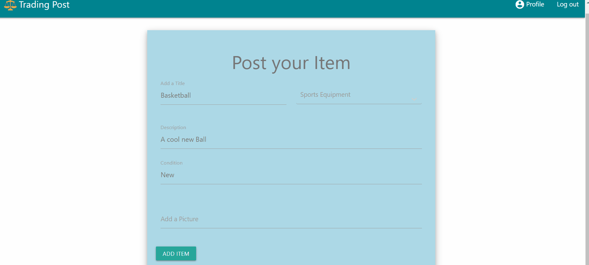

# Trading Post

[Deployed Link](https://degalo93.github.io/tradingpost2/)

[Server Back-end](https://github.com/Haldevel/trading-post-backend) 

Collaborators |
:---------:
* Samuel Thompson
* Denis Galo
* Halina Zmachynskaya

## Description
### An Craiglist inspired decoupled MERN app made with React and Redux, that uses its own JWT tokens for security and authorization of users. This app encourages the exchange of goods without currency.

### For this app we choose to follow a decouple architecture. A decoupled architecture is a framework for complex work that allows components to remain completely autonomous and unaware of each other. This allows for a clear process in where both front and backend can work succinctly to make a fully functional app.

### 

## Screenshots/GIFS

Landing Page |
:------------------:
 |

Search Page |
:------------------:
 |

Profile |
:------------------:
 |

## Important Code Details

Forms  |
:------------------:
 |

The forms are conditionally rendered where if the person clicks sign up or sign in the form will changed based off of user input. 

Posting Items  |
:------------------:
 |

For posting items we made the process easy for users to post the item that they want to trade. They have the option to edit the item or delete the post completely as soon as the user has traded it.

Technologies Used |
:---------:
* React
* Javascript
* CSS
* JQuery
* Materlize
* Mongo
* express
* cors
* redux
* Redux-react
