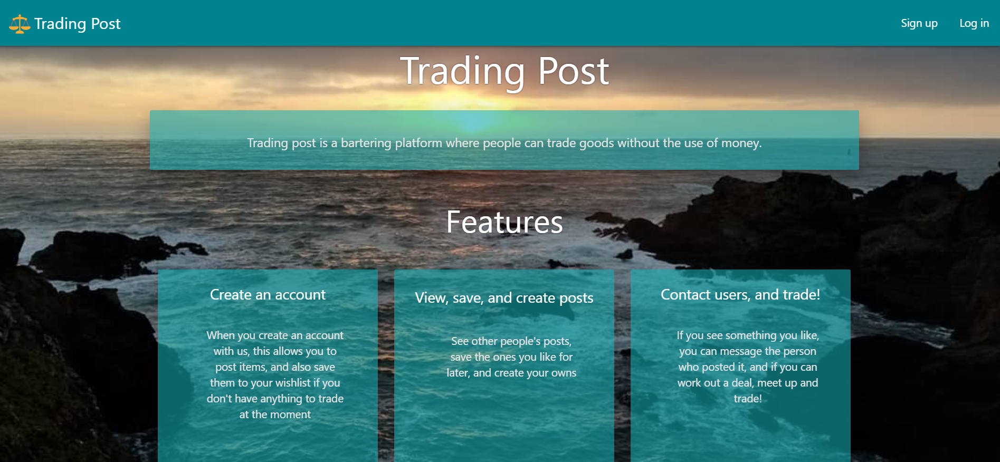
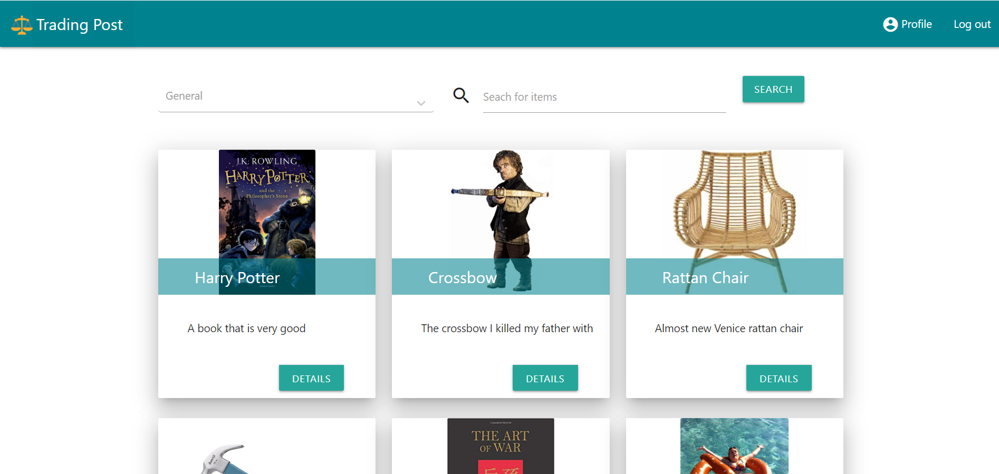
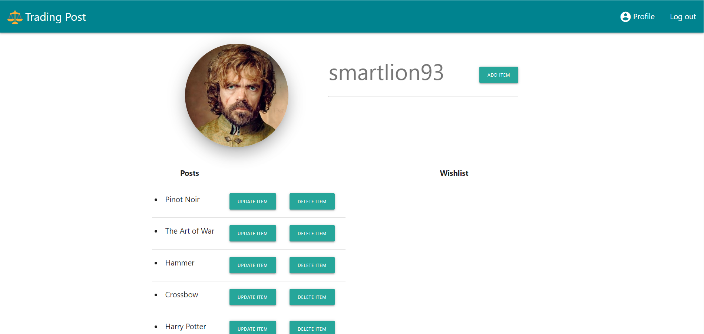

# Trading Post

[Deployed Link]()

Collaborators |
:---------:
* Samuel Thompson
* Denis Galo
* Halina Zmachynskaya

## Description
### An Craiglist inspired decoupled MERN app made with React and Redux, that uses its own JWT tokens for security and authorization of users. This app encourages the exchange of goods without currency.

### For this app we choose to follow a decouple architecture. A decoupled architecture is a framework for complex work that allows components to remain completely autonomous and unaware of each other. This allows for a clear process in where both front and backend can work succinctly to make a fully functional app.

### 

## Screenshots/GIFS

Landing Page |
:------------------:
 |

Search Page |
:------------------:
 |

Profile |
:------------------:
 |

## Important Code Details

Search  |
:------------------:
 |

Listing item|
:------------------:
 |

Server side |
:------------------:
 |

Technologies Used |
:---------:
* React
* Javascript
* CSS
* JQuery
* Materlize
* Mongo
* express
* cors
* redux
* Redux-react

This project was bootstrapped with [Create React App](https://github.com/facebook/create-react-app).

## Available Scripts

In the project directory, you can run:

### `npm start`

Runs the app in the development mode. 
Open [http://localhost:3000](http://localhost:3000) to view it in the browser.
